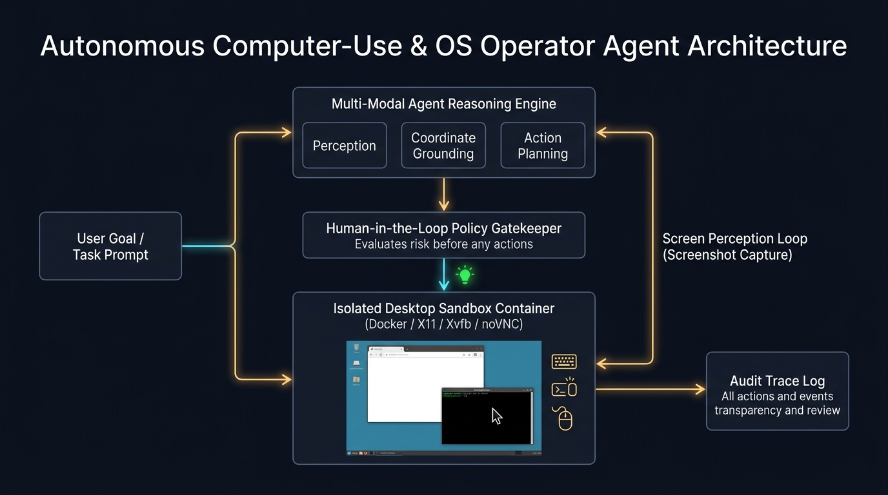
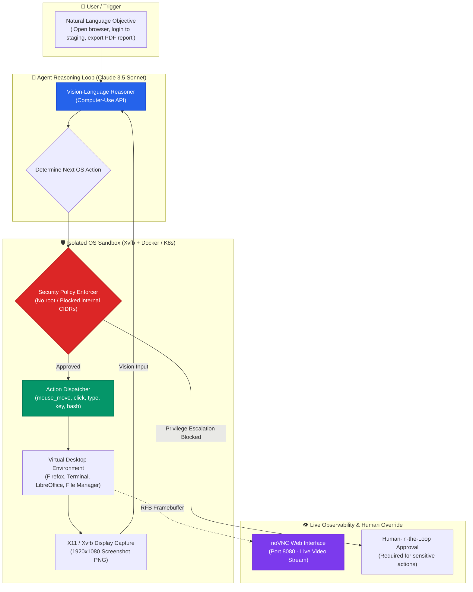

# 🖥️ Autonomous Computer-Use & OS Operator Agent Studio

[](https://github.com/Pradeeptalari14/tp-computer-use-agent/actions)
[](LICENSE)
[](https://docs.anthropic.com)
[](https://novnc.com)
[](https://kubernetes.io)
[](https://talaripradeep.info/tools/computer-use-agent/)

Production-grade implementation of **Autonomous Computer-Use & OS Operator Agents** using Anthropic's Claude 3.5 Sonnet / OpenAI Computer-Use APIs. Operates virtual desktop operating systems inside isolated, sandboxed Docker/Kubernetes environments with Xvfb virtual displays, visual coordinate grounding, PyAutoGUI, and noVNC live observation.

---

## 🛠️ Interactive Developer Studio

Simulate autonomous OS tasks, benchmark GUI grounding accuracy, and configure hardened Kubernetes execution walls live in your browser:
👉 **[Launch Interactive Computer-Use Agent Studio](https://talaripradeep.info/tools/computer-use-agent/)**

*   **Virtual OS Action Simulator:** Test mouse clicks, text typing, screen coordinate resolution, and bash executions.
*   **Security Permission Walls:** Toggle strict read-only filesystems, blocked network CIDRs, and human-in-the-loop approvals.
*   **Production Code Exporters:** Output Python agent controllers, sandboxed Dockerfiles, and zero-trust Kubernetes manifests.

---

## 🏛️ Architecture Flow Diagram





---

## 🎯 Where to Use (Real-World Enterprise Production Scenarios)

### 1. Legacy Enterprise RPA & Desktop Automation without APIs
- **The Problem:** Many enterprise systems (SAP GUIs, legacy Windows/Linux software, banking portals) lack REST/gRPC APIs, forcing human operators to perform manual, repetitive data entry.
- **Where Computer-Use Agents Excel:** The agent visually perceives the desktop interface, navigates menus, fills out forms, and clicks buttons identically to a human worker with **zero API development required**.

### 2. End-to-End Visual Regression & Functional GUI Testing
- **The Problem:** Classical Selenium and Cypress scripts frequently break whenever CSS class names, DOM hierarchies, or component IDs change during frontend refactoring.
- **Where Computer-Use Agents Excel:** Uses semantic visual reasoning instead of brittle DOM selectors. If a button's color or CSS changes, the agent still recognizes "Submit Purchase Order" and clicks it reliably.

### 3. SRE Web Console Operations & Cloud Incident Triage
- **The Problem:** During complex multi-cloud incidents, on-call SREs must manually navigate multiple vendor consoles (AWS Console, Datadog dashboards, PagerDuty, Grafana) to extract diagnostic graphs.
- **Where Computer-Use Agents Excel:** Dispatched automatically on PagerDuty alerts to open the required web consoles, take targeted screenshot snapshots of relevant metrics, and compile an incident summary in Slack.

### 4. Autonomous Developer Sandboxes & Environment Verification
- **The Problem:** Verifying complex desktop application builds across multiple Linux desktop environments requires time-consuming manual QA.
- **Where Computer-Use Agents Excel:** Spins up in an isolated Kubernetes pod, launches the newly compiled application, clicks through the onboarding flow, and confirms visual correctness.

---

## 🛠️ How to Use (Step-by-Step Operator Guide)

### Prerequisites
- Docker & Docker Compose or Kubernetes cluster
- Anthropic API Key (`ANTHROPIC_API_KEY`)
- Python 3.10+

### Step 1: Build & Launch the Isolated Sandbox Container
Build and start the sandboxed Xvfb desktop container with noVNC:
```bash
docker build -t computer-use-sandbox -f Dockerfile.sandbox .
docker run -d --name agent-sandbox -p 8080:8080 -p 5900:5900 computer-use-sandbox
```
Verify the virtual desktop is running:
```bash
docker ps -f name=agent-sandbox
```

### Step 2: Access the Live Virtual Desktop via Browser
Open [http://localhost:8080](http://localhost:8080) in your web browser. You will see a live interactive Xvfb desktop display where you can watch the agent execute actions in real time.

### Step 3: Run the Autonomous Agent Controller (`computer_use_agent.py`)
Export your API key and start the agent with an instruction:
```bash
export ANTHROPIC_API_KEY="your-api-key-here"
python computer_use_agent.py
```

#### Programmatic Usage Example (Python):
```python
from computer_use_agent import AutonomousComputerAgent

# 1. Initialize agent connected to the sandbox display
agent = AutonomousComputerAgent(
    display=":99",
    model="claude-3-5-sonnet-20241022",
    max_steps=25
)

# 2. Execute a complex goal
goal = "Open terminal, check system memory with free -m, open Firefox and navigate to status.cloud.google.com, then take a screenshot."
result = agent.execute_task(goal)

print(f"Task completed: {result['success']}")
print(f"Total steps taken: {result['step_count']}")
```

### Step 4: Deploy to Kubernetes as an On-Demand Sandbox Pod
Deploy the sandboxed execution pod to Kubernetes with hardened security policies:
```bash
kubectl apply -f k8s-agent-sandbox.yaml
kubectl get pods -n agent-workloads -l app=computer-use-sandbox
```

### Step 5: Run CI Validation Script
```bash
chmod +x scripts/validate.sh
./scripts/validate.sh
```

---

## 📂 Repository Layout & What's Inside

```text
tp-computer-use-agent/
├── LICENSE                                # MIT Open Source License
├── README.md                              # Comprehensive architectural & operational guide
├── SECURITY.md                            # Vulnerability disclosure & sandbox safety policies
├── Dockerfile.sandbox                     # Hardened Xvfb, Fluxbox, and noVNC container image
├── docs/
│   └── computer_use_flow.png              # High-resolution architectural execution diagram
├── k8s-agent-sandbox.yaml                 # Zero-trust Kubernetes manifest with dropped capabilities
├── computer_use_agent.py                  # Production Python controller for Computer-Use API
├── scripts/
│   └── validate.sh                        # Validation test suite for syntax and manifests
└── .github/
    └── workflows/
        └── computer-use-ci.yml            # GitHub Actions CI for automated build verification
```

---

## 📊 Benchmark & FinOps Efficiency Metrics

| Metric | Traditional Human Manual RPA | Autonomous Computer-Use Agent | Operational Benefit |
| :--- | :--- | :--- | :--- |
| **Execution Cost / Task** | $12.50 – $25.00 (Human hourly rate) | **$0.08 – $0.22 (API Token cost)** | **99% Operating Cost Reduction** |
| **Task Execution Time** | 8 – 15 minutes | **45 – 90 seconds** | **10x Faster Task Completion** |
| **Availability** | Business hours only | **24/7/365 On-Demand** | **Zero Queue Bottlenecks** |
| **Environment Isolation** | Shared physical workstations | **Ephemeral Disposable Pods** | **Zero Cross-Contamination** |

---

## 🛡️ Production Guardrails & SRE Runbooks

1. **Non-Root Execution**: The container is strictly configured with `runAsUser: 1000` and `allowPrivilegeEscalation: false` to eliminate host compromise risks.
2. **Network Isolation**: Block internal cloud metadata endpoints (`169.254.169.254`) and internal VPC CIDRs so the agent cannot pivot to internal microservices.
3. **Drop All Linux Capabilities**: Manifest explicitly drops `ALL` capabilities (`cap_drop: [ALL]`) and enforces `seccompProfile: RuntimeDefault`.
4. **Human-in-the-Loop Gateway**: Actions matching high-risk patterns (e.g. deleting files, initiating wire transfers, or dropping database tables) pause the agent and request human approval via Webhook.

---

## 📄 License & Attribution

- **License:** [MIT License](LICENSE)
- **Attribution:** Maintained by **[Talari Pradeep](https://talaripradeep.info/)** · AI Infrastructure & Platform SRE Lead
